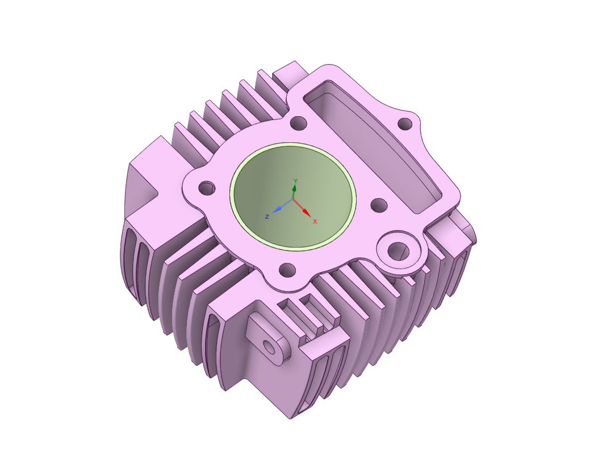
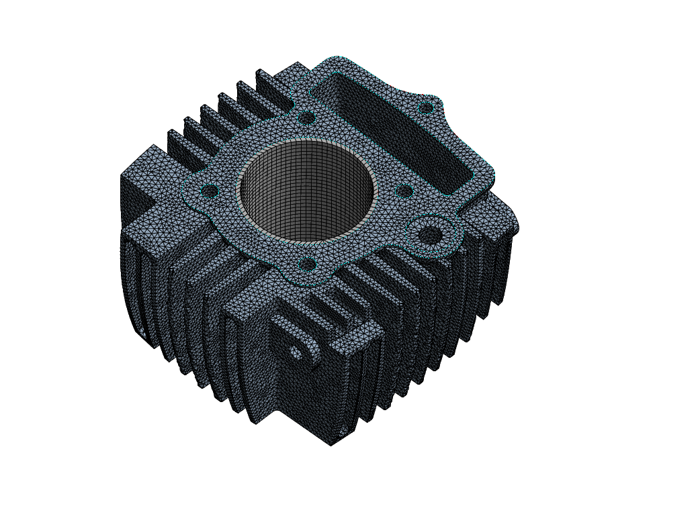

# Thermal Analysis of IC Engine Cylinder Block using Different Materials

## Project Overview
The engine cylinder is a critical automobile component subjected to high temperature variations and thermal stresses. This project performs a thermal analysis on engine cylinder fins to understand heat dissipation inside the cylinder.Fins are mechanical structures that use convection to cool the engine.This study compares the thermal performance of three different materials to optimize cooling and efficiency.

## Engine Specifications
The analysis was based on the following engine parameters:
* **Engine Type**: Single cylinder, four-stroke.
* **Displacement**: 97.50 cubic cm (5.95 cubic inches).
* **Power**: 7.37 HP (5.4 kW) @ 8000 RPM.
* **Torque**: 7.95 Nm (0.8 kgf-m) @ 5000 RPM.

## Material Properties
The following properties were used for the simulation:

| Sr.No. | Property | Aluminium Alloy Gr. 6061 | Gray Cast Iron | Titanium Alloy |
| :--- | :--- | :---: | :---: | :---: |
| 1 | Thermal Conductivity (K) | 155.3 W/mk | 52 W/mk  | 21.9 W/mk  |
| 2 | Co-efficient of Thermal Expansion | 2.78 x 10⁵ K  | 1.1 x 10⁵ K  | 9.4 x 10⁶ K  |
| 3 | Specific Heat | 915 J/Kg K | 447 J/Kg K  | 522 J/Kg K  |
| 4 | Density | 2.7 g/cc  | 7.2 g/cc  | 4.62 g/cc  |
| 5 | Ambient Temperature | 295 K  | 295 K  | 295 K  |
| 6 | Film Coefficient | 5 x 10⁶ W/mm²°C  | 5 x 10⁶ W/mm²°C  | 5 x 10⁶ W/mm²°C  |
| 7 | Poisson's Ratio | 0.33  | 0.28  | 0.36  |

## Methodology
1. **Data Aggregation**: Collected information associated with cooling fins of IC engines.
2. **CAD Modeling**: Created a parametric model of the cylinder block with fins in **Solidworks**.
3. **FEA Analysis**: Imported the model into **ANSYS 22.0 (Workbench)** for Transient Thermal analysis.
4. **Meshing**: Generated a mesh with **665,435 nodes** and **414,332 elements** using a 2 mm element size.
5. **Comparison**: Compared heat rate, thermal gradient, and nodal temperatures across materials.

## Boundary Conditions
* **Maximum Internal Temperature**: 1000°C.
* **Initial Temperature**: 140°C (Assumed).
* **Ambient Temperature**: 22°C.
* **Heat Flow**: 100 W (Calculated manually).
* **Convection Type**: Average Film Temperature.

## Simulation Results

### 1. Geometry & Meshing
Detailed parametric model and high-density mesh generated for analysis.
* **Nodes**: 665,435  
* **Elements**: 414,332  

---

### 2. Temperature Distribution
Comparison of nodal temperatures under a maximum internal temperature of 1000°C.

| Gray Cast Iron | Titanium Alloy |
| :---: | :---: |
|  |  |
| *Max: 1000.1°C* | *Max: 1005°C* |

---

### 3. Total Heat Flux
Analysis of heat dissipation performance across the fin surfaces.

| Gray Cast Iron | Titanium Alloy |
| :---: | :---: |
|  |  |

---

### 4. Directional Heat Flux
Comparison of heat flow vectors within the cylinder block.

| Gray Cast Iron | Titanium Alloy |
| :---: | :---: |
|  |  |

## Conclusion
The study concludes that **Titanium Alloy** offers several advantages for engine cylinder blocks:
* **Weight Reduction**: Significant reduction in overall engine weight leads to improved fuel efficiency and lower emissions.
* **Corrosion Resistance**: Exceptional resistance in high-temperature and high-pressure environments.
* **Heat Transfer**: Effective heat dissipation prevents overheating and engine damage.
* **Thermal Compatibility**: A coefficient of thermal expansion close to aluminum reduces risks of thermal stress between components.
* **Design Flexibility**: High formability allows for complex fin designs and tighter manufacturing tolerances.

## References
* Ansys ACP User's Guide.
* International Research Journal of Engineering and Technology (IRJET).
* Trier University of Applied Sciences, Labor für Strukturdynamik.
